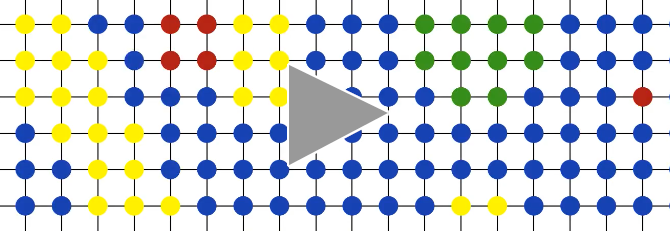

# Computing Separable Functions via Gossip

Implementation of the algorithm in "Computing separable functions via gossip." [1] applied to the mixing of colours in a grid network.

## Demo

[(dark)](https://daniel.wilshirejones.com/res/animation_dark.mp4)

### Handling Network Partitions
This visualisation shows a grid network which has been partitioned and split across it's diagonal. Halfway through the simulation, a bridge forms between the two partitions. It shows the following properties quite nicely:
  1. The blue partition displays some perturbations despite all of it's nodes starting with the exact same colour. This demonstrates the stochastic nature of using the emperical mean of a random variable to transfer information.
  2. Despite there only being two connections between the partitions, they are able to reach a visual consensus relatively quickly.
  
## Setup
For the video output to work, [ffmpeg](https://www.ffmpeg.org/) should be installed and working on your system. Besides that, it's the usual Python affair:
  1. Make a virtualenv: `python3 -m venv env`.
  2. Install dependencies: `pip install -r requirements.txt`.

## Generating the Demo
  1. Activate the virtualenv in your fave shell: `source ./env/bin/activate`.
  2. Run the demo script: `python3 ./averaging_colors.py`.
  3. Wait a couple of minutes and the file `./averaging_colors.mp4` should appear.

## Usage
The code for the demo (averaging colors over a grid network) is separated out from the main algorithm implementation, which can be found in `algorithm.py`. You can import those functions in your own scripts if you're keen to play around.

## References

[1]: Mosk-Aoyama, Damon, and Devavrat Shah. "Computing separable functions via gossip." Proceedings of the twenty-fifth annual ACM symposium on Principles of distributed computing. ACM, 2006.
